# TÀI LIỆU THIẾT KẾ HỆ THỐNG
# HỆ THỐNG QUẢN LÝ NHÂN SỰ - TIỀN LƯƠNG

> Hướng dẫn: Copy từng block code PlantUML vào https://www.plantuml.com/plantuml/uml/ để xuất hình ảnh.

---

## 2.1. BIỂU ĐỒ PHÂN CẤP CHỨC NĂNG HỆ THỐNG

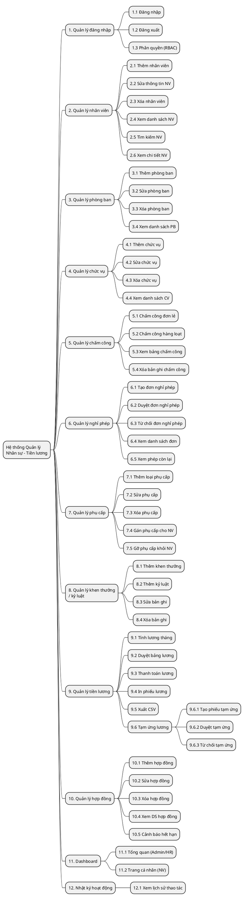

---

## 2.2. BIỂU ĐỒ USE CASE

### 2.2.1. Use Case tổng quát

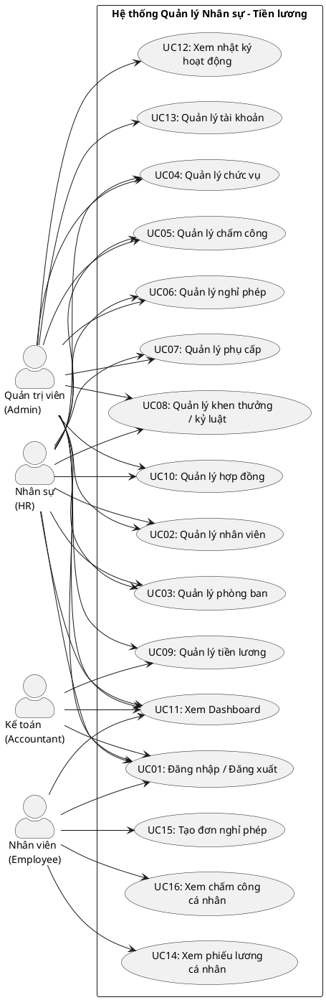

### 2.2.2. Phân rã Use Case - Quản lý nhân viên (UC02)

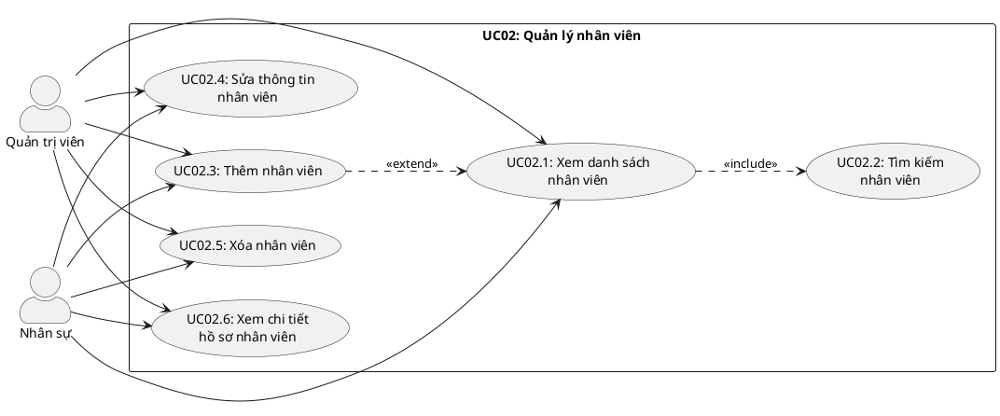

### 2.2.3. Phân rã Use Case - Quản lý tiền lương (UC09)

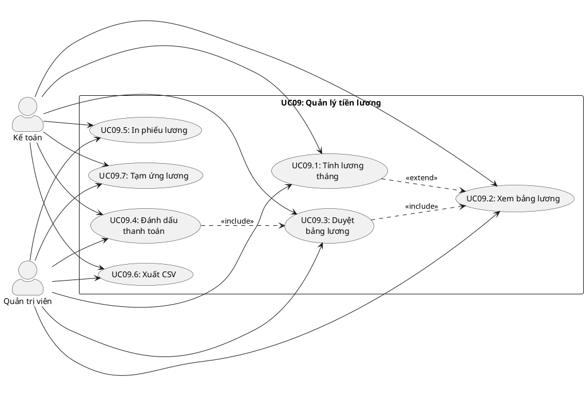

### 2.2.4. Phân rã Use Case - Quản lý nghỉ phép (UC06)

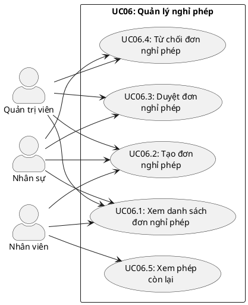

### 2.2.5. Phân rã Use Case - Quản lý chấm công (UC05)

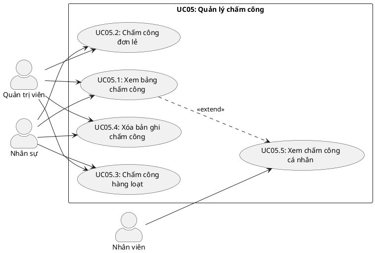

---

## 2.3. BIỂU ĐỒ TUẦN TỰ (SEQUENCE DIAGRAM)

### 2.3.1. Biểu đồ tuần tự - Đăng nhập hệ thống

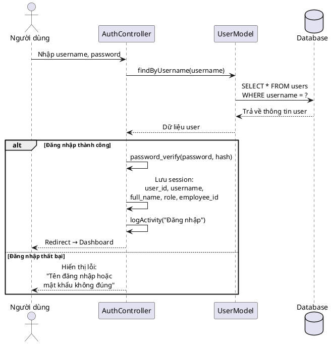

### 2.3.2. Biểu đồ tuần tự - Tính lương tháng

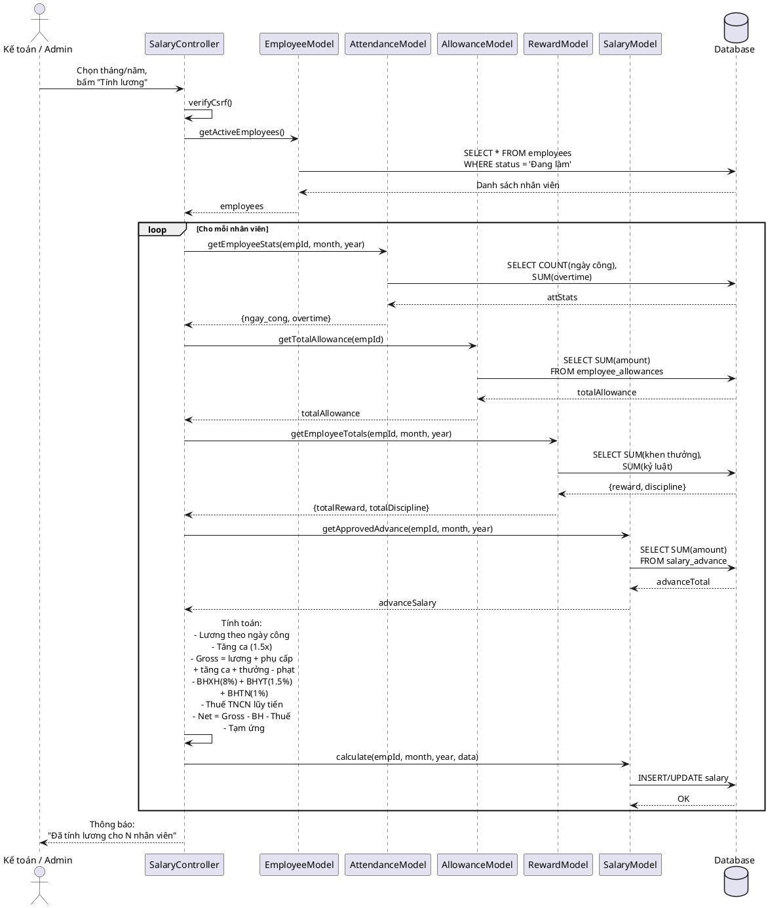

### 2.3.3. Biểu đồ tuần tự - Xin nghỉ phép (Nhân viên)

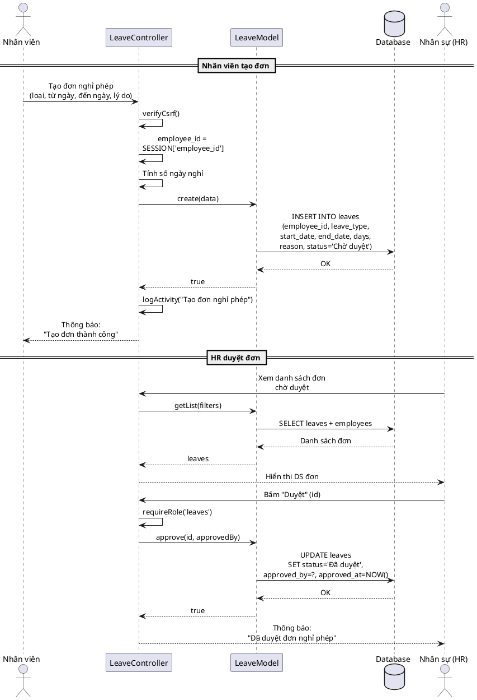

### 2.3.4. Biểu đồ tuần tự - Thêm nhân viên

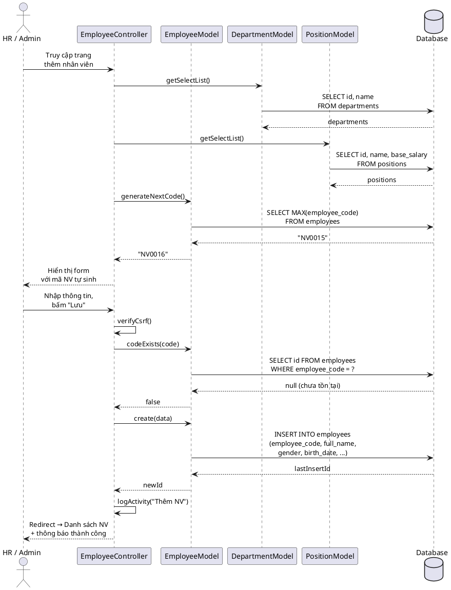

### 2.3.5. Biểu đồ tuần tự - Chấm công hàng loạt

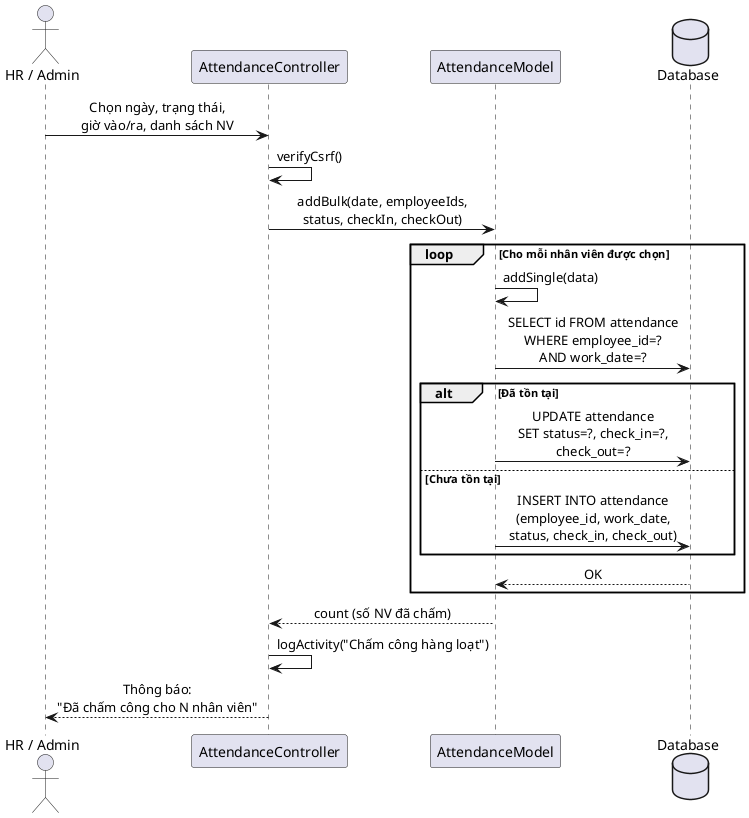

---

## 2.4. BIỂU ĐỒ LỚP (CLASS DIAGRAM)

```plantuml
@startuml
skinparam classAttributeIconSize 0

' ==================== CORE ====================
abstract class Controller {
    # conn : mysqli
    # currentUser : array
    # rolePermissions : array
    --
    + __construct()
    # view(viewPath, data)
    # viewOnly(viewPath, data)
    # redirect(path)
    # requireAuth()
    # requireRole(permission)
    # hasPermission(permission) : bool
    # isPost() : bool
    # post(key, default) : string
    # get(key, default) : string
    # setFlash(type, message)
    # verifyCsrf()
    # generateCsrf() : string
    # logActivity(action, module, detail)
    # model(modelName) : Model
}

abstract class Model {
    # conn : mysqli
    # table : string
    --
    + __construct()
    # query(sql, params, types) : mysqli_result
    # queryOne(sql, params, types) : array|null
    # execute(sql, params, types) : bool
    # insert(sql, params, types) : int
    # findAll(orderBy) : mysqli_result
    # findById(id) : array|null
    # count(where) : int
    # delete(id) : bool
    # emptyResult() : mysqli_result
}

class App {
    # controller : string
    # method : string
    # params : array
    --
    + __construct()
    - parseUrl() : array
}

' ==================== CONTROLLERS ====================
class AuthController {
    + login()
    + logout()
    + notFound()
}

class DashboardController {
    + index()
    - employeeDashboard()
}

class EmployeeController {
    + index()
    + create()
    + store()
    + edit(id)
    + update(id)
    + show(id)
    + delete(id)
}

class DepartmentController {
    + index()
}

class PositionController {
    + index()
}

class AttendanceController {
    + index()
    + store()
    + bulkStore()
    + delete(id)
}

class LeaveController {
    + index()
    - createLeave(model, isEmployee)
    - approveLeave(model)
    - rejectLeave(model)
}

class AllowanceController {
    + index()
    + assign()
    + remove()
}

class RewardController {
    + index()
}

class SalaryController {
    + index()
    + calculate()
    + detail(id)
    + advance()
    + payslip(id)
    + export()
}

class ContractController {
    + index()
    - createContract(model)
    - updateContract(model)
    - deleteContract(model)
}

' ==================== MODELS ====================
class UserModel {
    # table = "users"
    --
    + findByUsername(username) : array
    + getAllUsers() : mysqli_result
    + create(data) : int
    + update(id, data) : bool
    + updateProfile(id, data) : bool
    + changePassword(id, newPassword) : bool
    + usernameExists(username, excludeId) : bool
}

class EmployeeModel {
    # table = "employees"
    --
    + getList(filters, page, perPage) : array
    + getDetail(id) : array
    + create(data) : int
    + update(id, data) : bool
    + codeExists(code, excludeId) : bool
    + getActiveEmployees() : mysqli_result
    + getActiveCount() : int
    + getNewThisMonth() : int
    + getByDepartmentStats() : mysqli_result
    + getRecentEmployees(limit) : mysqli_result
    + generateNextCode() : string
}

class DepartmentModel {
    # table = "departments"
    --
    + getAllWithCount() : mysqli_result
    + create(data) : int
    + update(id, data) : bool
    + hasEmployees(id) : bool
    + getSelectList() : mysqli_result
}

class PositionModel {
    # table = "positions"
    --
    + getAllWithCount() : mysqli_result
    + create(data) : int
    + update(id, data) : bool
    + hasEmployees(id) : bool
    + getSelectList() : mysqli_result
    + getByDepartment(deptId) : mysqli_result
}

class AttendanceModel {
    # table = "attendance"
    --
    + getByMonth(month, year, deptId) : mysqli_result
    + getStats(month, year) : array
    + addSingle(data) : bool
    + addBulk(date, empIds, status, in, out) : int
    + getEmployeeAttendance(empId, m, y) : mysqli_result
    + getEmployeeStats(empId, m, y) : array
    + deleteRecord(id) : bool
}

class LeaveModel {
    # table = "leaves"
    --
    + getList(filters) : mysqli_result
    + create(data) : int
    + approve(id, approvedBy) : bool
    + reject(id, approvedBy) : bool
    + getEmployeeLeaves(empId, year) : mysqli_result
    + getLeaveBalance(empId, year) : array
    + getPendingCount() : int
    + getStats(month, year) : array
}

class AllowanceModel {
    # table = "allowances"
    --
    + getAllWithCount() : mysqli_result
    + create(data) : int
    + update(id, data) : bool
    + hasEmployees(allowanceId) : bool
    + isAssigned(empId, allowanceId) : bool
    + getAllAssignments() : mysqli_result
    + getEmployeeAllowances(empId) : mysqli_result
    + assignToEmployee(empId, allowId, amount) : bool
    + removeFromEmployee(id) : bool
    + getTotalAllowance(empId) : float
}

class RewardModel {
    # table = "rewards"
    --
    + getList(filters) : mysqli_result
    + create(data) : int
    + update(id, data) : bool
    + getByEmployee(empId, m, y) : mysqli_result
    + getStats(month, year) : array
    + getEmployeeTotals(empId, m, y) : array
}

class SalaryModel {
    # table = "salary"
    --
    + getByMonth(month, year, status) : mysqli_result
    + getDetail(id) : array
    + getTotals(month, year) : array
    + calculate(empId, month, year, data) : bool
    + approve(id) : bool
    + approveAll(month, year) : bool
    + markPaid(id) : bool
    + getByEmployeeId(empId, m, y) : array
    + getEmployeeSalaryHistory(empId) : mysqli_result
    + getMonthlyTrend(months) : mysqli_result
    + getAdvances(month, year, status) : mysqli_result
    + createAdvance(data) : int
    + approveAdvance(id) : bool
    + rejectAdvance(id) : bool
    + getApprovedAdvance(empId, m, y) : float
}

class ContractModel {
    # table = "contracts"
    --
    + getList(filters) : mysqli_result
    + create(data) : int
    + update(id, data) : bool
    + getByEmployee(empId) : mysqli_result
    + getExpiringContracts(days) : mysqli_result
    + getStats() : array
}

' ==================== RELATIONSHIPS ====================
Controller <|-- AuthController
Controller <|-- DashboardController
Controller <|-- EmployeeController
Controller <|-- DepartmentController
Controller <|-- PositionController
Controller <|-- AttendanceController
Controller <|-- LeaveController
Controller <|-- AllowanceController
Controller <|-- RewardController
Controller <|-- SalaryController
Controller <|-- ContractController

Model <|-- UserModel
Model <|-- EmployeeModel
Model <|-- DepartmentModel
Model <|-- PositionModel
Model <|-- AttendanceModel
Model <|-- LeaveModel
Model <|-- AllowanceModel
Model <|-- RewardModel
Model <|-- SalaryModel
Model <|-- ContractModel

App --> Controller : khởi tạo
Controller --> Model : sử dụng

EmployeeController ..> EmployeeModel
EmployeeController ..> DepartmentModel
EmployeeController ..> PositionModel
DashboardController ..> EmployeeModel
DashboardController ..> SalaryModel
DashboardController ..> LeaveModel
DashboardController ..> ContractModel
DashboardController ..> AttendanceModel
SalaryController ..> SalaryModel
SalaryController ..> EmployeeModel
SalaryController ..> AttendanceModel
SalaryController ..> AllowanceModel
SalaryController ..> RewardModel
@enduml
```

---

## 2.6. THIẾT KẾ DATABASE

### Mô tả tổng quan

- **DBMS:** MySQL (InnoDB)
- **Character Set:** utf8mb4 (hỗ trợ tiếng Việt đầy đủ)
- **Collation:** utf8mb4_unicode_ci
- **Database name:** ql_nhansu_luong
- **Tổng số bảng:** 13 bảng

### Danh sách các bảng

| STT | Tên bảng | Mô tả | Số trường |
|-----|----------|-------|-----------|
| 1 | users | Tài khoản người dùng | 10 |
| 2 | departments | Phòng ban | 5 |
| 3 | positions | Chức vụ | 6 |
| 4 | employees | Nhân viên | 19 |
| 5 | attendance | Chấm công | 9 |
| 6 | allowances | Loại phụ cấp | 4 |
| 7 | employee_allowances | Gán phụ cấp cho NV | 5 |
| 8 | rewards | Khen thưởng / Kỷ luật | 7 |
| 9 | salary | Bảng lương | 22 |
| 10 | salary_advance | Tạm ứng lương | 9 |
| 11 | leaves | Nghỉ phép | 10 |
| 12 | contracts | Hợp đồng lao động | 10 |
| 13 | activity_log | Nhật ký hoạt động | 7 |

---

## 3.1. XÂY DỰNG DATABASE TRÊN MYSQL

### SQL tạo database

```sql
CREATE DATABASE IF NOT EXISTS `ql_nhansu_luong`
CHARACTER SET utf8mb4
COLLATE utf8mb4_unicode_ci;

USE `ql_nhansu_luong`;
```

---

## 3.2.1. CẤU TRÚC CÁC BẢNG

### Bảng 1: users (Tài khoản người dùng)

| Tên trường | Kiểu dữ liệu | Ràng buộc | Mô tả |
|-----------|--------------|-----------|-------|
| id | INT | PRIMARY KEY, AUTO_INCREMENT | Mã tài khoản |
| username | VARCHAR(50) | NOT NULL, UNIQUE | Tên đăng nhập |
| password | VARCHAR(255) | NOT NULL | Mật khẩu (bcrypt hash) |
| full_name | VARCHAR(100) | NOT NULL | Họ và tên |
| email | VARCHAR(100) | DEFAULT NULL | Email |
| role | ENUM('admin','hr','accountant','employee') | NOT NULL, DEFAULT 'hr' | Vai trò |
| employee_id | INT | DEFAULT NULL | Liên kết nhân viên |
| status | TINYINT(1) | NOT NULL, DEFAULT 1 | Trạng thái (1=active) |
| created_at | DATETIME | DEFAULT CURRENT_TIMESTAMP | Ngày tạo |
| updated_at | DATETIME | ON UPDATE CURRENT_TIMESTAMP | Ngày cập nhật |

### Bảng 2: departments (Phòng ban)

| Tên trường | Kiểu dữ liệu | Ràng buộc | Mô tả |
|-----------|--------------|-----------|-------|
| id | INT | PRIMARY KEY, AUTO_INCREMENT | Mã phòng ban |
| name | VARCHAR(100) | NOT NULL | Tên phòng ban |
| manager_name | VARCHAR(100) | DEFAULT NULL | Tên trưởng phòng |
| phone | VARCHAR(20) | DEFAULT NULL | Số điện thoại |
| description | TEXT | DEFAULT NULL | Mô tả |
| created_at | DATETIME | DEFAULT CURRENT_TIMESTAMP | Ngày tạo |

### Bảng 3: positions (Chức vụ)

| Tên trường | Kiểu dữ liệu | Ràng buộc | Mô tả |
|-----------|--------------|-----------|-------|
| id | INT | PRIMARY KEY, AUTO_INCREMENT | Mã chức vụ |
| name | VARCHAR(100) | NOT NULL | Tên chức vụ |
| department_id | INT | FK → departments(id), ON DELETE SET NULL | Phòng ban |
| base_salary | DECIMAL(15,0) | DEFAULT 0 | Lương cơ bản |
| description | TEXT | DEFAULT NULL | Mô tả |
| created_at | DATETIME | DEFAULT CURRENT_TIMESTAMP | Ngày tạo |

### Bảng 4: employees (Nhân viên)

| Tên trường | Kiểu dữ liệu | Ràng buộc | Mô tả |
|-----------|--------------|-----------|-------|
| id | INT | PRIMARY KEY, AUTO_INCREMENT | Mã nhân viên (hệ thống) |
| employee_code | VARCHAR(20) | NOT NULL, UNIQUE | Mã nhân viên (NV0001) |
| full_name | VARCHAR(100) | NOT NULL | Họ và tên |
| gender | VARCHAR(10) | DEFAULT 'Nam' | Giới tính |
| birth_date | DATE | DEFAULT NULL | Ngày sinh |
| id_card | VARCHAR(20) | DEFAULT NULL | Số CCCD/CMND |
| phone | VARCHAR(20) | DEFAULT NULL | Số điện thoại |
| email | VARCHAR(100) | DEFAULT NULL | Email |
| address | TEXT | DEFAULT NULL | Địa chỉ |
| department_id | INT | FK → departments(id), ON DELETE SET NULL | Phòng ban |
| position_id | INT | FK → positions(id), ON DELETE SET NULL | Chức vụ |
| hire_date | DATE | DEFAULT NULL | Ngày vào làm |
| contract_type | VARCHAR(50) | DEFAULT NULL | Loại hợp đồng |
| base_salary | DECIMAL(15,0) | DEFAULT 0 | Lương cơ bản |
| bank_account | VARCHAR(30) | DEFAULT NULL | Số tài khoản NH |
| bank_name | VARCHAR(100) | DEFAULT NULL | Tên ngân hàng |
| status | VARCHAR(20) | DEFAULT 'Đang làm' | Trạng thái |
| created_at | DATETIME | DEFAULT CURRENT_TIMESTAMP | Ngày tạo |
| updated_at | DATETIME | ON UPDATE CURRENT_TIMESTAMP | Ngày cập nhật |

### Bảng 5: attendance (Chấm công)

| Tên trường | Kiểu dữ liệu | Ràng buộc | Mô tả |
|-----------|--------------|-----------|-------|
| id | INT | PRIMARY KEY, AUTO_INCREMENT | Mã bản ghi |
| employee_id | INT | NOT NULL, FK → employees(id), ON DELETE CASCADE | Nhân viên |
| work_date | DATE | NOT NULL | Ngày làm việc |
| status | VARCHAR(20) | DEFAULT 'Đi làm' | Trạng thái (Đi làm/Đi muộn/Nghỉ phép/Vắng) |
| check_in | TIME | DEFAULT NULL | Giờ vào |
| check_out | TIME | DEFAULT NULL | Giờ ra |
| overtime_hours | DECIMAL(5,1) | DEFAULT 0 | Số giờ tăng ca |
| note | TEXT | DEFAULT NULL | Ghi chú |
| created_at | DATETIME | DEFAULT CURRENT_TIMESTAMP | Ngày tạo |

> UNIQUE KEY `uk_emp_date` (`employee_id`, `work_date`) — Mỗi nhân viên chỉ có 1 bản ghi/ngày.

### Bảng 6: allowances (Loại phụ cấp)

| Tên trường | Kiểu dữ liệu | Ràng buộc | Mô tả |
|-----------|--------------|-----------|-------|
| id | INT | PRIMARY KEY, AUTO_INCREMENT | Mã phụ cấp |
| name | VARCHAR(100) | NOT NULL | Tên phụ cấp |
| default_amount | DECIMAL(15,0) | DEFAULT 0 | Mức phụ cấp mặc định |
| description | TEXT | DEFAULT NULL | Mô tả |
| created_at | DATETIME | DEFAULT CURRENT_TIMESTAMP | Ngày tạo |

### Bảng 7: employee_allowances (Gán phụ cấp cho NV)

| Tên trường | Kiểu dữ liệu | Ràng buộc | Mô tả |
|-----------|--------------|-----------|-------|
| id | INT | PRIMARY KEY, AUTO_INCREMENT | Mã bản ghi |
| employee_id | INT | NOT NULL, FK → employees(id), ON DELETE CASCADE | Nhân viên |
| allowance_id | INT | NOT NULL, FK → allowances(id), ON DELETE CASCADE | Loại phụ cấp |
| amount | DECIMAL(15,0) | DEFAULT 0 | Số tiền thực tế |
| created_at | DATETIME | DEFAULT CURRENT_TIMESTAMP | Ngày tạo |

> UNIQUE KEY `uk_emp_allow` (`employee_id`, `allowance_id`) — Mỗi NV chỉ nhận 1 lần mỗi loại.

### Bảng 8: rewards (Khen thưởng / Kỷ luật)

| Tên trường | Kiểu dữ liệu | Ràng buộc | Mô tả |
|-----------|--------------|-----------|-------|
| id | INT | PRIMARY KEY, AUTO_INCREMENT | Mã bản ghi |
| employee_id | INT | NOT NULL, FK → employees(id), ON DELETE CASCADE | Nhân viên |
| type | ENUM('Khen thưởng','Kỷ luật') | NOT NULL | Loại |
| reason | TEXT | NOT NULL | Lý do |
| amount | DECIMAL(15,0) | DEFAULT 0 | Số tiền |
| date | DATE | DEFAULT NULL | Ngày quyết định |
| decision_number | VARCHAR(50) | DEFAULT NULL | Số quyết định |
| created_at | DATETIME | DEFAULT CURRENT_TIMESTAMP | Ngày tạo |

### Bảng 9: salary (Bảng lương)

| Tên trường | Kiểu dữ liệu | Ràng buộc | Mô tả |
|-----------|--------------|-----------|-------|
| id | INT | PRIMARY KEY, AUTO_INCREMENT | Mã bảng lương |
| employee_id | INT | NOT NULL, FK → employees(id), ON DELETE CASCADE | Nhân viên |
| month | INT | NOT NULL | Tháng |
| year | INT | NOT NULL | Năm |
| working_days | INT | DEFAULT 0 | Số ngày công chuẩn |
| actual_working_days | INT | DEFAULT 0 | Ngày công thực tế |
| base_salary | DECIMAL(15,0) | DEFAULT 0 | Lương cơ bản |
| total_allowance | DECIMAL(15,0) | DEFAULT 0 | Tổng phụ cấp |
| overtime_hours | DECIMAL(5,1) | DEFAULT 0 | Giờ tăng ca |
| overtime_pay | DECIMAL(15,0) | DEFAULT 0 | Tiền tăng ca |
| total_reward | DECIMAL(15,0) | DEFAULT 0 | Tổng thưởng |
| total_discipline | DECIMAL(15,0) | DEFAULT 0 | Tổng phạt |
| gross_salary | DECIMAL(15,0) | DEFAULT 0 | Tổng lương gộp |
| bhxh | DECIMAL(15,0) | DEFAULT 0 | BHXH (8%) |
| bhyt | DECIMAL(15,0) | DEFAULT 0 | BHYT (1.5%) |
| bhtn | DECIMAL(15,0) | DEFAULT 0 | BHTN (1%) |
| tax | DECIMAL(15,0) | DEFAULT 0 | Thuế TNCN |
| advance_salary | DECIMAL(15,0) | DEFAULT 0 | Tạm ứng |
| other_deduction | DECIMAL(15,0) | DEFAULT 0 | Khấu trừ khác |
| net_salary | DECIMAL(15,0) | DEFAULT 0 | Lương thực nhận |
| status | VARCHAR(20) | DEFAULT 'Chờ duyệt' | Trạng thái |
| approved_by | INT | DEFAULT NULL | Người duyệt |
| approved_at | DATETIME | DEFAULT NULL | Ngày duyệt |
| paid_at | DATETIME | DEFAULT NULL | Ngày thanh toán |
| created_at | DATETIME | DEFAULT CURRENT_TIMESTAMP | Ngày tạo |

> UNIQUE KEY `uk_emp_month` (`employee_id`, `month`, `year`) — Mỗi NV chỉ có 1 bảng lương/tháng.

### Bảng 10: salary_advance (Tạm ứng lương)

| Tên trường | Kiểu dữ liệu | Ràng buộc | Mô tả |
|-----------|--------------|-----------|-------|
| id | INT | PRIMARY KEY, AUTO_INCREMENT | Mã phiếu tạm ứng |
| employee_id | INT | NOT NULL, FK → employees(id), ON DELETE CASCADE | Nhân viên |
| amount | DECIMAL(15,0) | NOT NULL | Số tiền tạm ứng |
| reason | TEXT | DEFAULT NULL | Lý do |
| month | INT | NOT NULL | Tháng |
| year | INT | NOT NULL | Năm |
| status | VARCHAR(20) | DEFAULT 'Chờ duyệt' | Trạng thái |
| approved_by | INT | DEFAULT NULL | Người duyệt |
| approved_at | DATETIME | DEFAULT NULL | Ngày duyệt |
| created_at | DATETIME | DEFAULT CURRENT_TIMESTAMP | Ngày tạo |

### Bảng 11: leaves (Nghỉ phép)

| Tên trường | Kiểu dữ liệu | Ràng buộc | Mô tả |
|-----------|--------------|-----------|-------|
| id | INT | PRIMARY KEY, AUTO_INCREMENT | Mã đơn nghỉ phép |
| employee_id | INT | NOT NULL, FK → employees(id), ON DELETE CASCADE | Nhân viên |
| leave_type | VARCHAR(50) | NOT NULL, DEFAULT 'Nghỉ phép năm' | Loại nghỉ phép |
| start_date | DATE | NOT NULL | Ngày bắt đầu |
| end_date | DATE | NOT NULL | Ngày kết thúc |
| days | INT | NOT NULL, DEFAULT 1 | Số ngày nghỉ |
| reason | TEXT | DEFAULT NULL | Lý do |
| status | VARCHAR(20) | DEFAULT 'Chờ duyệt' | Trạng thái |
| approved_by | INT | DEFAULT NULL | Người duyệt |
| approved_at | DATETIME | DEFAULT NULL | Ngày duyệt |
| created_at | DATETIME | DEFAULT CURRENT_TIMESTAMP | Ngày tạo |

### Bảng 12: contracts (Hợp đồng lao động)

| Tên trường | Kiểu dữ liệu | Ràng buộc | Mô tả |
|-----------|--------------|-----------|-------|
| id | INT | PRIMARY KEY, AUTO_INCREMENT | Mã hợp đồng |
| employee_id | INT | NOT NULL, FK → employees(id), ON DELETE CASCADE | Nhân viên |
| contract_number | VARCHAR(50) | DEFAULT NULL | Số hợp đồng |
| contract_type | VARCHAR(50) | NOT NULL | Loại hợp đồng |
| start_date | DATE | NOT NULL | Ngày bắt đầu |
| end_date | DATE | DEFAULT NULL | Ngày kết thúc |
| base_salary | DECIMAL(15,0) | DEFAULT 0 | Mức lương theo HĐ |
| note | TEXT | DEFAULT NULL | Ghi chú |
| status | VARCHAR(20) | DEFAULT 'Hiệu lực' | Trạng thái |
| created_at | DATETIME | DEFAULT CURRENT_TIMESTAMP | Ngày tạo |
| updated_at | DATETIME | DEFAULT NULL | Ngày cập nhật |

### Bảng 13: activity_log (Nhật ký hoạt động)

| Tên trường | Kiểu dữ liệu | Ràng buộc | Mô tả |
|-----------|--------------|-----------|-------|
| id | INT | PRIMARY KEY, AUTO_INCREMENT | Mã bản ghi |
| user_id | INT | NOT NULL, FK → users(id), ON DELETE CASCADE | Tài khoản |
| action | VARCHAR(255) | NOT NULL | Hành động |
| module | VARCHAR(50) | NOT NULL | Module |
| detail | TEXT | DEFAULT NULL | Chi tiết |
| ip_address | VARCHAR(45) | DEFAULT NULL | Địa chỉ IP |
| created_at | DATETIME | DEFAULT CURRENT_TIMESTAMP | Thời gian |

---

## 3.2.2. SƠ ĐỒ QUAN HỆ (ER DIAGRAM)

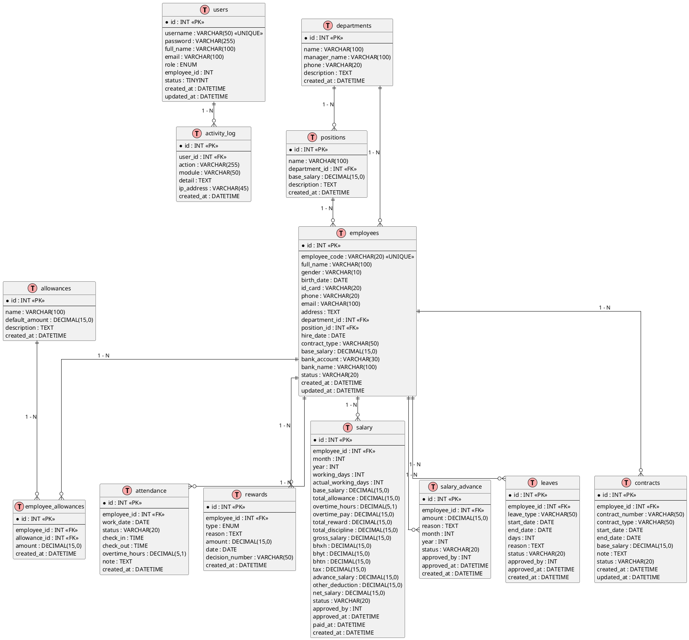

### Mô tả quan hệ giữa các bảng

| STT | Quan hệ | Mô tả | Loại |
|-----|---------|-------|------|
| 1 | departments → employees | Một phòng ban có nhiều nhân viên | 1 - N |
| 2 | departments → positions | Một phòng ban có nhiều chức vụ | 1 - N |
| 3 | positions → employees | Một chức vụ có nhiều nhân viên | 1 - N |
| 4 | employees → attendance | Một NV có nhiều bản ghi chấm công | 1 - N |
| 5 | employees → leaves | Một NV có nhiều đơn nghỉ phép | 1 - N |
| 6 | employees → contracts | Một NV có nhiều hợp đồng | 1 - N |
| 7 | employees → rewards | Một NV có nhiều khen thưởng/kỷ luật | 1 - N |
| 8 | employees → salary | Một NV có nhiều bảng lương (theo tháng) | 1 - N |
| 9 | employees → salary_advance | Một NV có nhiều phiếu tạm ứng | 1 - N |
| 10 | employees ↔ allowances | Quan hệ N-N thông qua employee_allowances | N - N |
| 11 | users → activity_log | Một tài khoản có nhiều nhật ký | 1 - N |

### Công thức tính lương

```
Lương theo ngày công = Lương cơ bản × (Ngày công thực tế / Ngày công chuẩn)
Tiền tăng ca         = Giờ tăng ca × (Lương cơ bản / (Ngày công chuẩn × 8)) × 1.5
Tổng thu nhập (Gross) = Lương theo ngày + Phụ cấp + Tăng ca + Thưởng - Phạt
BHXH                  = Lương cơ bản × 8%
BHYT                  = Lương cơ bản × 1.5%
BHTN                  = Lương cơ bản × 1%
Thu nhập chịu thuế    = Gross - BHXH - BHYT - BHTN
Thuế TNCN             = Tính theo biểu lũy tiến từng phần (giảm trừ 11 triệu)
Lương thực nhận (Net) = Gross - BHXH - BHYT - BHTN - Thuế - Tạm ứng
```

### Biểu thuế TNCN lũy tiến từng phần

| Bậc | Thu nhập chịu thuế / tháng | Thuế suất |
|-----|---------------------------|-----------|
| 1 | Đến 5 triệu | 5% |
| 2 | Trên 5 - 10 triệu | 10% |
| 3 | Trên 10 - 18 triệu | 15% |
| 4 | Trên 18 - 32 triệu | 20% |
| 5 | Trên 32 - 52 triệu | 25% |
| 6 | Trên 52 - 80 triệu | 30% |
| 7 | Trên 80 triệu | 35% |

> Giảm trừ gia cảnh bản thân: 11.000.000 đ/tháng
> Giảm trừ người phụ thuộc: 4.400.000 đ/người/tháng
